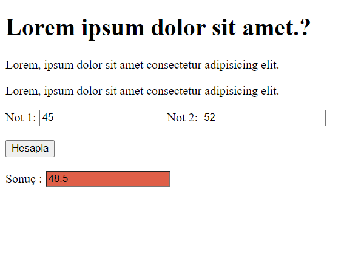
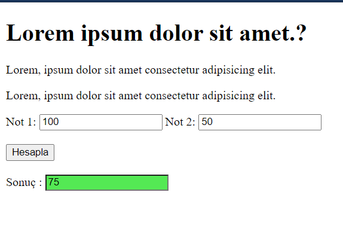

# 13.07.2021
Kullanıcıdan not 1 ve not 2 girilmesi istenir. Ortalama hesaplanır ve sonuç kısmına yazılır. Sonuç  50 den büyük veya eşit ise  sonuc inputunun background colorı  yeşil değilse kırmızı olur.
 

