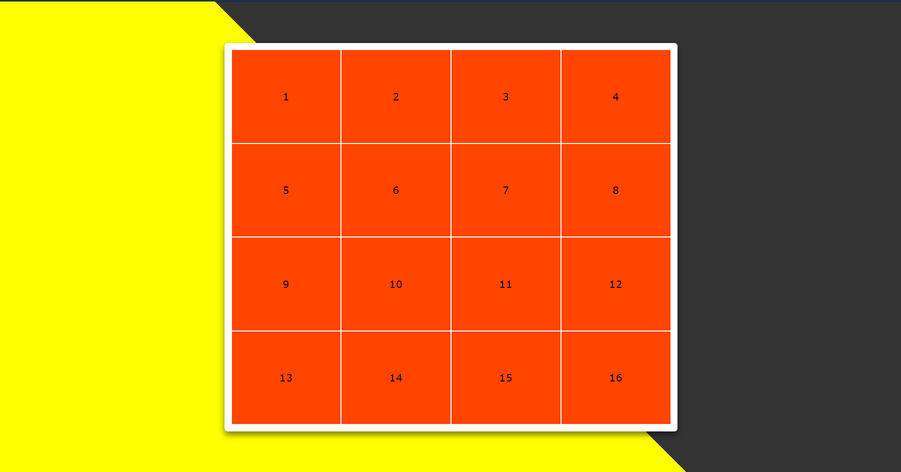

# 16-19.07.2021

Görev: Html, css, js, jquery ile kart eşleştirme oyununun yapılması.
## 1
Kart eşleştirme oyunu için tasarım oluşturuldu.


## 2
Eşleştirme için kart oluşturuldu.
Kartlara gerekli css özelikleri eklendi.

## 3
* Clean code için ayrı js css ve html dosyaları oluşturuldu.
Oluşturulmus olan tasarıma kart entegre edildi.
* Kart için oluşturulan card-style css dosyasına  kartlara ait css özellikleri taşındı.
* cardScript.js dosyası oluşturulup kartlara jquery ile click gibi fonksiyonlar eklendi.
#### Yararlanılan kaynaklar:
* [w3schools.com/css](https://www.w3schools.com/css/default.asp) 
* [w3schools.com/jquery](https://www.w3schools.com/jquery/default.asp)

## 4
* önceki aşamada oluşturulan html dosyası çok tekrardan dolayı uzun çok satıra sahip idi.
Jquery ile  sınıflar oluşturarak append gibi fonksiyonlarla  html tagları yeniden oluşturuldu.
* 200 satırlık html kodu 20 satıra indirgendi ve myScript js dosyasında 32 satırlık kod kullanılarak yeniden html dosyası oluşturuldu.
* Html taglarına  gerekli css özellikleri(class,color vb) eklendi.


#### Karşılaştığım  hata vb. durumlar için yararlandığım kaynaklar:
https://stackoverflow.com/questions/10619445/the-preferred-way-of-creating-a-new-element-with-jquery
* [jquery_css_classes](https://www.w3schools.com/jquery/jquery_css_classes.asp)

## 5
* Color css dosyası eklendi.
* Kartlara random  renk atanması için algoritma oluşturuldu.
kod myScript  js dosyasına  eklendi.
* Renklerin 2 den fazla eklenmesi gibi bir hata ile karşılaşıldı.
Oluşturulan bir dizi ile  tekrarlanan  renkler kontrol edildi ve gerekli durumda silinmesi sağlandı.
```javascript

            //random color add
            // Blocking more than 2 repetitions
            var rd;
            var isRp=true;
            while(isRp){
                var rp=0;
                rd=Math.floor(Math.random() * myColor.length);
                for(let i=0; i<repeatColor.length; i++){
                    if(myColor[rd]==repeatColor[i]){
                        rp++;
                    }
                }
                // Blocking more than 2 repetitions
                if(rp==2){
                    var remove_Item = myColor[rd];
                    myColor = $.grep(myColor, function(value) {
                    return value != remove_Item;
                    });
                }
                if(rp<2){
                    repeatColor.push(myColor[rd]);
                    $(td_card).addClass(myColor[rd])
                    console.log(myColor[rd]);
                    isRp=false;
                }
            }
```
## 6
* İki kartın eşleşme durumu için algoritma oluşturuldu.
* Oluşturulan algoritma cardScript js dosyasında kod olarak eklendi.
* Mantık :
click olan yerin rengi bir değişkene atandı. bu değişkende bir diziye eklendi.
Diziye 2 renk eklendikten sonra bu  iki renk aynı mı diye kontrol ediliyor.
Aynı ise bulunduğumuz html tagın  altındaki taga aşağıda belirtilen css kodu eklenir.Bu şekilde kart silinir.
```javascript
    $(this).filter(function() {
        return true;
      }).each(function() {
        $(this).children().css("pointer-events","none"); 
      })
```
* Aynı karta 2 kere tıklanıldığında kendi kendini silme gibi bir hata ile karşılaşıldı.

## 7
* Çift tıklamada oluşan bug için aşağıdaki kod  click fonksiyonu çalıştığında ilgili kartın css dosyasına eklendi.
Timer ve  if  ile css dosyasından bu özelliğin eklenmesi ve değiştirilmesi sağlandı.
```javascript  //dont touch card
      $(this).css("pointer-events","none");
```
* Start için play tuşu eklendi ve gerekli css özellikleri oluşturuldu.
* js kronomotre kodu eklendi ve gerekli css özellikleri oluşturuldu.
* Tüm kartlar eşleştiğinde oluşacak durum kontrol edilip gerekli js kodu eklendi.

* Oyunda fare ile sağ tıklayıp incele denildiğinde ve f12' ye basıldığında güvenlik açığı oluşturduğu tespit edildi.
bunun için aşağıdaki kod kullanıldı.Bu kod myScript js dosyasına eklendi.
 ```javascript
   // Here 123 is the keyCode of F12 which opens the Inspect Element screen in the browser. Adding a keydown event than only does return false for 123 will block the Inspect Element screen.
    $(document).keydown(function (event) {
        if (event.keyCode == 123) { // Prevent F12
            return false;
        } else if (event.ctrlKey && event.shiftKey && event.keyCode == 73) { // Prevent Ctrl+Shift+I
            return false;
        }
    });
    // Prevent Right Click > Inspect Element
    $(document).on("contextmenu", function (e) {
        e.preventDefault();
    });
```

#### Karşılaşılan hatalarda yararlanılan kaynaklar:
* [CSS pointer-events Property](https://www.w3schools.com/cssref/css3_pr_pointer-events.asp)
* [How can I block F12 keyboard key in jquery for all my pages and elements?](https://stackoverflow.com/questions/28575722/how-can-i-block-f12-keyboard-key-in-jquery-for-all-my-pages-and-elements)

## 8 
* [Oyunun kaynak kodu](https://github.com/maruf04/cardgame.github.io)
* [Oyunun çalışır hali](https://maruf04.github.io/cardgame.github.io/)
